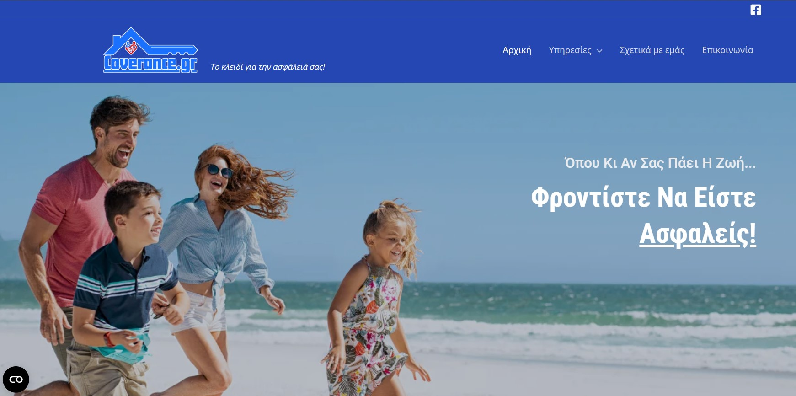

# 👋 Hello, I’m Ioanna

I am a Junior Front-End Developer with expertise in HTML, CSS, JavaScript, React, Java, Spring Boot, MySQL and WordPress.
I specialize in building responsive, fast, and visually appealing websites and apps that deliver excellent user experiences and meet business goals.

## 🛠️ Technologies & Tools

  
  
  
  
  
  
  
  
   
  
  

## 🌐 Selected Projects
### 1. Business Websites

Developed corporate websites with responsive design and SEO optimization using WordPress.

#### Kingpools.gr

 
🔗 [Live Demo](https://www.kingpools.gr)

#### Coverance.gr

 
🔗 [Live Demo](https://www.coverance.gr)

### 2. Figma to Website project

Converted a Figma design into a fully functional website using HTML, Tailwind CSS, and JavaScript.

  
🔗 [Live Demo](https://jeanne9999.github.io/figma-site/) | 💻 [Repository](https://github.com/Jeanne9999/figma-site)

### 3. Mini App – Age Calculator

Developed a JavaScript app that lets the user insert his name and birth date and displays a message with his/her exact age.

  
🔗 [Live Demo](https://jeanne9999.github.io/sev-data-input-project/)💻 [Repository](https://github.com/Jeanne9999/sev-data-input-project)

### 4. Mini App – Random Quotes

Developed a JavaScript app that displays random quotes with a click of a button.

  
🔗 [Live Demo](https://jeanne9999.github.io/quote-generator/) | 💻 [Repository](https://github.com/Jeanne9999/quote-generator)

## 📫 Contact
- [LinkedIn](https://linkedin.com/in/ioanna-kotronaki-97403b255)  
- [Email](mailto:i.kotronaki@gmail.com)
